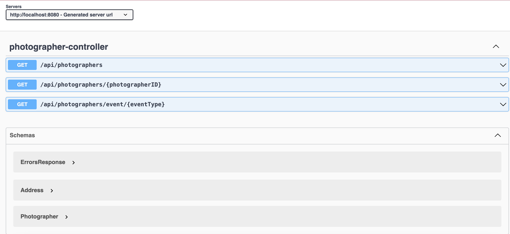
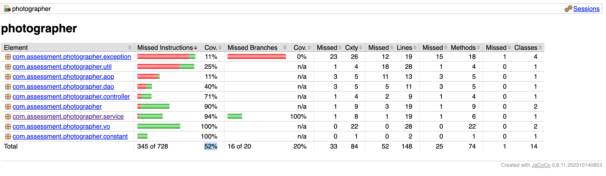

# Assessment

### Implementation details

### Server startup 

```agsl
./mvnw spring-boot:run 
```

### UI links (Swagger)

* [Swagger UI](http://localhost:8080/api-ui.html)
  
* 
* 
* [API Docs](http://localhost:8080/api-docs)

### Validation commands

```agsl
curl -v http://localhost:8080/api/photographers #Photographer 
curl -v http://localhost:8080/api/photographers/1 
curl -v http://localhost:8080/event/WEDDING

```

#### Data json 
```
${PROJECT_ROOT}/data/photographer.json
```

#### Docker config
${PROJECT_ROOT}/Dockerfile

#### Code Coverage


